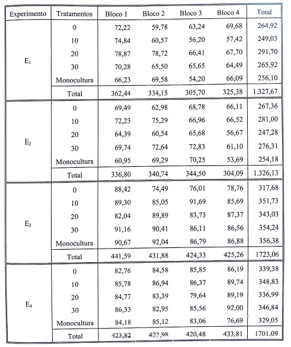

# Capítulo 12: Análise de conjunta de experimentos  
  
## Exemplo 12.2 (Pág. 328)  
Para exemplificar a obtenção da análise conjunta, vamos utilizar os dados obtidos de Rezende (2008), referentes a 4 experimentos em blocos casualizados, descritos a seguir:  

E~1~ = Consórcio de alface crespa (Verônica) com linha dupla de pepino, realizado em 2005;  
E~2~ = Consórcio de alface crespa (Verônica) com linha simples de pepino, realizado em 2005;  
E~3~ = Consórcio de alface crespa (Verônica) com linha dupla de pepino, realizado em 2006;  
E~4~ = Consórcio de alface crespa (Verônica) com linha simples de pepino, realizado em 2006.  
  
Nos 4 experimentos estudaram-se os efeitos de 5 tratamentos (Transplantio de alface aos 0, 10, 20, 30 após o transplantio de pepino (DAT) e na monocultura de pepino), sobre a porcentagem de frutos na classe de tamanho 20 (PCLAS20):  
  

### Carregar os dados  

Para baixar o arquivo:   (`https://www.dropbox.com/s/u70ggbn17cdmht5/exemplo12_2.csv?dl=0`)  

Carregar os dados a partir do link.
```{r}
dados12_2 = read.csv("https://www.dropbox.com/s/u70ggbn17cdmht5/exemplo12_2.csv?dl=1", header = TRUE, sep = ";", dec = ".")
head(dados12_2) # exibir as primeiras linhas para conferir
```
  

### Análise por meio do pacote **Easyanova**

Caso deseje ajuda sobre o comando, carregue o pacote e depois execute o comando `help("ea2")`. 

```{r, message=FALSE, warning=FALSE}
library(easyanova)
ea2(dados12_2, design = 11, alpha = 0.05, cov = 4, 
    list = FALSE, p.adjust=1, plot=1)
```

#### Compare e discuta os resultados com aqueles apresentados no livro-texto.
