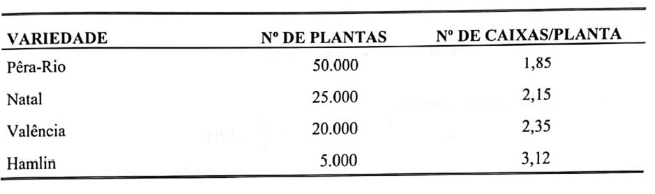
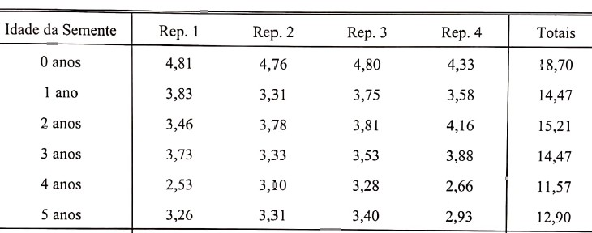
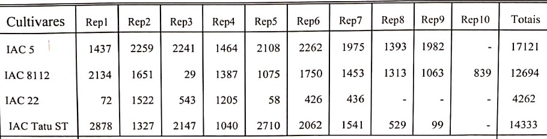
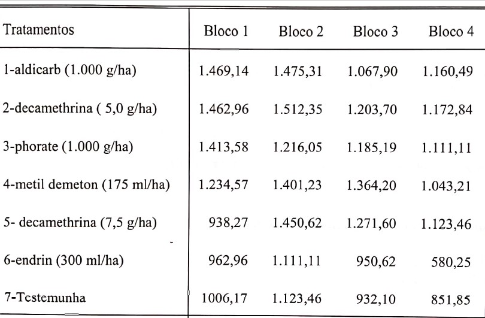
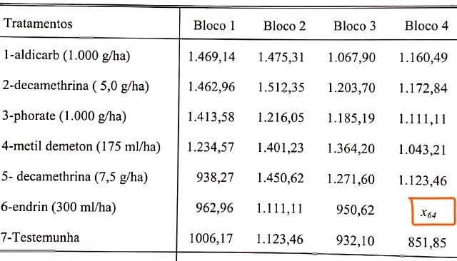
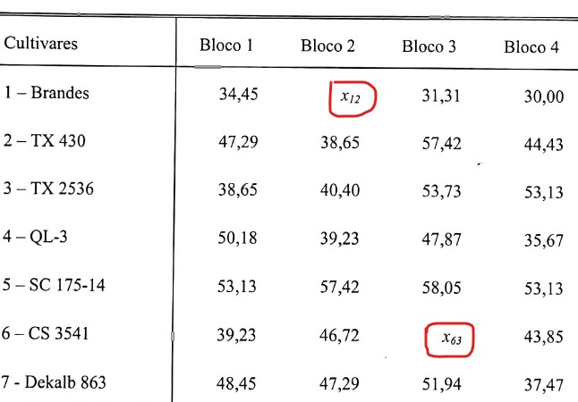
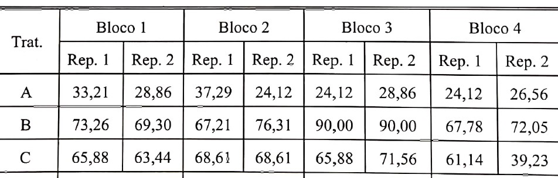

Neste material são apresentadas sugestões de soluções, executadas no R, para os exemplos do Livro Experimentação Agronômica & AgroEstat: Sistema para Análises Estatísticas de Ensaios Agronômicos. 
O livro será utilizado como referência principal no Curso de Extensão de **Análise de experimentos agronômicos com o *Software* R**.  
A escolha por este livro e não por obras clássicas como o Pimentel-Gomes (2009) e Banzatto & Kronka (2008) ou até mesmo o Design and Analysis of Experiments, de Dean & Voss (1999), se deu por muitos motivos, com destaque a dois: O primeiro se deve à qualidade do material produzido pelos autores José Carlos Barbosa e Walter Maldonado Júnior. O outro ponto se deu porque o livro apresenta os exemplos resolvidos por meio do *Software* AgroEstat. Isso permite ao aluno conferir os resultados obtidos no R e, ao final, terá familiaridade com dois bons *softwares* de apoio à análise de experimentos.  
Sugerimos uma leitura minuciosa dos exemplos à medida que acompanha os resultados apresentados no R.  
Segue informações da obra:  
BARBOSA, J. C.; MALDONADO JÚNIOR, W. **Experimentação Agronômica & AgroEstat: Sistema para análises de ensaios agronômicos**. Jaboticabal: Gráfica Multipress LTDA, 2015.  
{ width=35% }


# Capítulo 1: Introdução  
## Exemplo 1: Cálculo de medidas descritivas (pág. 4)  
Considere como exemplo os dados seguntes, referentes ás alturas (cm) de 30 plantas de milho do cultivar OPACO 2, obtidos por Barbosa (1976):

### Inclusão dos dados
```{r dados}
dados1_1 <- c(232,218,207,188,227,228,185,217,202,207,220,234,178,213,
              188,175,207,200,195,189,215,217,213,218,192,195,181,207,
              220,225)
```


### Cálculo das medidas descritivas da amostra
```{r medidas descritivas}
mean(dados1_1) # média dos dados
var(dados1_1) # variância
sd(dados1_1) # desvio-padrao
summary(dados1_1) #sumário de medidas descritivas
sd(dados1_1)/sqrt(length(dados1_1)) # erro padrão da média
(sd(dados1_1)/mean(dados1_1))*100 # Coeficiente de variacao (CV)
```

### Obteção do gráfico boxplot dos dados
```{r boxplot}
boxplot(dados1_1, main="Análise de dados Exemplo 1.1", 
        ylab = "Altura(cm)")
```

### Assimetria e curtose
```{r assimetria e curtose}
hist(dados1_1, 
     main = "Histograma dos dados",
     xlab = "Intervalo",
     ylab = "frequência",
     freq = FALSE,
     xlim = c(140,280))
abline(v=mean(dados1_1), col="red", lwd=2)
curve(dnorm(x, mean(dados1_1), sd(dados1_1)), add = TRUE, 
      col="blue", lwd=2)

library(e1071)

curtose1_1<-kurtosis(dados1_1, na.rm = TRUE, type = 2) #calcula a curtose
curtose1_1

assimetria1_1<-skewness(dados1_1, na.rm = TRUE, type = 2) #calcula a assimetria
assimetria1_1
```

### Exemplo média ponderada (Pág. 5)  
Supondo que se deseja estimar a produtividade média de laranja em caixas de 40,8 kg por planta em uma Fazenda que possui três talhões de quatro cariedades, cujos números de plantas e produtividades são apresentadas na Tabela a seguir:


```{r cálculo média ponderada}
#Inclusão dos dados
variedade = c("pera-rio", "natal", "valencia", "hamlin")
num_plantas = c(50000,25000,20000,5000)
caixa_por_planta = c(1.85,2.15,2.35,3.12)

#cálculo da média ponderada
media_pond = sum((num_plantas*caixa_por_planta))/sum(num_plantas)
media_pond
```

# Capítulo 4: Delineamento Inteiramente casualizado  
  
## Exemplo 4.5 (Pág. 65)  
Num experimento inteiramente casualizado, realizado por ZAMPIERI (1982), estudou-se o efeito da idade da semente sobre a capacidade de emergência e o vigor de semenentes de maracujá amarelo. Foram utilizados como tratamentos, sementes de 0,1,2,3,4 e 5 anos de idade, e os resultados obtidos para o comprimento médio do hipocótilo das plântulas (cm) foram os seguintes:


### Inclusão dos dados 
```{r dados exemplo 4.5, include=TRUE}
idade = c(rep("0anos",4), rep("1ano",4), rep("2anos",4), rep("3anos",4),
          rep("4anos",4), rep("5anos",4))
idade = as.factor(idade)
idade

comp_med = c(4.81,4.76,4.80,4.33,3.83,3.31,3.75,3.58,
             3.46,3.78,3.81,4.16,3.73,3.33,3.53,3.88,
             2.53,3.10,3.28,2.66,3.26,3.31,3.40,2.93)
comp_med

# banco de dados
dados4_5 = data.frame(idade, comp_med)
head(dados4_5, 10) # exibe apenas as 10 primeiras linhas
```

As hipóteses a serem testadas são:  
H~0~: As idades das sementes testadas possuem efeitos semelhantes sobre o comprimento do hipocótilo das plântulas  
H~A~: As idades das sementes testadas possuem efeitos diferentes sobre o comprimento do hipocótilo das plântulas

### Determinação da anova
```{r anova exemplo 4.4}
anova4_5 = aov(comp_med ~ idade, data = dados4_5)
summary(anova4_5)
```

Conclusão: Os resultados apontam para a rejeição de H~0~ em favor da hipótese alternativa, permitindo concluir que as idades das sementes possuem efeitos diferentes sobre o comprimento do hipocótilo das plântulas de maracujá amarelo, ao nível de significância 5%.  

### Análise dos pressupostos
#### Visualização gráfica prévia

```{r}
par(mfrow=c(2,2)) #visualizar 4 gráficos na mesma figura (2 linas e 2 colunas)
plot(anova4_5) # plotar o gráfico
par(mfrow=c(1,1)) # retornar a visualização gráfica normal
```

#### Normalidade dos resíduos
```{r}
residuos4_5 = anova4_5$residuals # cria um objeto com os resíduos do modelo

library(nortest)
shapiro.test(residuos4_5)
ad.test(residuos4_5)
lillie.test(residuos4_5)
ks.test(residuos4_5, "pnorm", mean(residuos4_5), sd(residuos4_5))
```

Verificou-se que os resíduos apresentaram normalidade (p-valor > 0,05)


#### Homogeneidade das variâncias
```{r, warning=FALSE, message=FALSE}
library(car)  
leveneTest(residuos4_5 ~ dados4_5$idade)
bartlett.test(residuos4_5 ~ dados4_5$idade)
```

Verificou-se homoneidade em relação aos resíduos (p > 0,05)

OBS: Aconselha-se uma leitura no item **4.3 Hipóteses básicas para aplicação da Análise de Variância**, do livro texto, página 59.

Uma vez rejeitada a hipótese de semelhança entre os tratamentos e os devidos pressupostos para aplicação da Anova, deve-se proceder com o **teste de comparação de médias**.  
Neste exemplo, serão utilizados três pacotes (packages) diferentes, para fins de aprendizado.  Doravante utilizar-se-á somente o que mais se adequadar aos exercícios e à critério do autor deste material.  

OBS: Confira os resultados obtidos como livro (pág. 68). Faça os cálculos, pois ajuda a fixar o conhecimento sobre o assunto.


Utilizando o pacote **ExpDes**
```{r, warning=FALSE, message=FALSE}
library(ExpDes)
library(ExpDes.pt)
dic(dados4_5$idade, dados4_5$comp_med, quali = TRUE,mcomp = "tukey",
    nl = FALSE, hvar = "bartlett", sigT = 0.05, sigF = 0.05)
```


Utilizando o pacote **agricolae**
```{r, warning=FALSE, message=FALSE}
library(agricolae)
teste_ex4_5 = HSD.test(anova4_5,"idade",console=TRUE)
bar.group(teste_ex4_5$groups,ylim=c(0,6), main = "Teste de Tukey",
          ylab = "Comprimento médio do hipocotilo")
```


Utilizando o pacote **easyanova**
```{r, message=FALSE, warning=FALSE, eval=TRUE}
library(easyanova)
ea4_5 = ea1(dados4_5, design = 1, alpha = 0.05, list = FALSE, 
    p.adjust=1, plot=1)
```

```{r}
ea4_5$Means
```


## Exemplo 4_6_2 (Pág. 69)  
  
Análise de um experimento inteiramente casualizado não balanceado, referente ao número de ovos de adultos de *Spodoptera frugiperda*, cujas lagartas foram alimentadas com folhas de cultivares de amendoim, obtidos do trabalho de Campos (2011):


As hipóteses a serem testadas são:  
H~0~: As cultivares de amendoim não diferem entre si, quanto o número de ovos de *Spodoptera frugiperda*.  
H~A~: As cultivares de amendoim diferem entre si, quanto o número de ovos de *Spodoptera frugiperda*.  

### Carregar os dados  
Se você baixou o banco de dados deve tornar o diretório onde os salvou como direitório de trabalho (`ctrl + shift + H`), escolha o diretório e depois copie e cole o comando.  
`setwd("caminho do diretório")`  
Em seguida executar o comando para carregar os dados.
`dados4_6_2 = read.csv("exemplo4_6_2", header = TRUE, sep = ";", dec = ".")`  

Carregar os dados a partir do link.
```{r}
dados4_6_2 = read.csv("https://raw.githubusercontent.com/genivaldomoreira/Analise_experimentos_agronomicos/main/Dados/exemplo4_6_2.csv", header = TRUE, sep = ";", dec = ".")
head(dados4_6_2, 10) # exibir as 10 primeiras linhas para conferir
```
Caso deseje visualizar o banco de dados completo, basta usar o comando `dados4_6_2`.  

### Determinação da anova
```{r anova exemplo 4.6.2}
anova4_6_2 = aov(quant ~ cultivares, data = dados4_6_2)
summary(anova4_6_2) # conferir o resultado na pag 71
```

Conclusão: Deve-se rejeitar H~0~ (p-valor < 0,05).

### Análise dos pressupostos  
#### Visualização gráfica prévia  
  
```{r}
par(mfrow=c(2,2)) #visualizar 4 gráficos na mesma figura (2 linhas e 2 colunas)
plot(anova4_6_2) # plotar o gráfico
par(mfrow=c(1,1)) # retornar a visualização gráfica normal
```

#### Normalidade dos resíduos
```{r}
residuos4_6_2 = anova4_6_2$residuals # cria um objeto com os resíduos do modelo

library(nortest)
shapiro.test(residuos4_6_2)
ad.test(residuos4_6_2)
lillie.test(residuos4_6_2)
ks.test(residuos4_6_2, "pnorm", mean(residuos4_6_2), sd(residuos4_6_2))
```

Verificou-se que os resíduos apresentaram normalidade (p-valor > 0,05)


#### Homogeneidade das variâncias
```{r, warning=FALSE, message=FALSE}
library(car)  
leveneTest(residuos4_6_2 ~ dados4_6_2$cultivares)
bartlett.test(residuos4_6_2 ~ dados4_6_2$cultivares)
```

Verificou-se homoneidade em relação aos resíduos (p > 0,05)

Uma vez rejeitada a hipótese de semelhança entre os tratamentos e os devidos pressupostos para aplicação da Anova, deve-se proceder com o **teste de comparação de médias**.    


Utilizando o pacote **ExpDes**
```{r, warning=FALSE, message=FALSE}
library(ExpDes)
library(ExpDes.pt)
dic(dados4_6_2$cultivares, dados4_6_2$quant, quali = TRUE,
    mcomp = "tukey",nl = FALSE, hvar = "bartlett", 
    sigT = 0.05, sigF = 0.05)
```


Utilizando o pacote **agricolae**
```{r, warning=FALSE, message=FALSE}
library(agricolae)
teste_ex4_6_2 = HSD.test(anova4_6_2,"cultivares",console=TRUE, unbalanced = TRUE)
bar.group(teste_ex4_6_2$groups,ylim=c(0,2500), main = "Teste de Tukey",ylab = "Quant. de ovos de Spodoptera frugiperda")
```

# Capítulo 5: Delineamento em Blocos Casualizados  
  
## Exemplo 5.5 (Pág. 119)  
Num experimento em blocos casualizados, realizados por ARF (1981), estudou-se o efeito de inseticidas no controle do tripes (*Enneothrips flavens* Moulton, 1941) na cultura do amendoim. Foram utilizados 7 tratamentos e 4 blocos, com os blocos controlando diferenças de infestação da cultura. Os resultados obtidos para a producao de vagens, em kg/ha, foram os seguintes:
 

As hipóteses a serem testadas são:  
H~0~: Os inseticidas testados possuem efeitos semelhantes sobre a produção de vagens da cultura do amendoim.  
H~A~: Os inseticidas testados possuem efeitos diferentes sobre a produção de vagens da cultura do amendoim.  

### Carregar os dados  

Carregar os dados a partir do link.
```{r}
dados5_5 = read.csv("https://raw.githubusercontent.com/genivaldomoreira/Analise_experimentos_agronomicos/main/Dados/exemplo5_5.csv", header = TRUE, sep = ";", dec = ".")
head(dados5_5) # exibir as 6 primeiras linhas para conferir
```
Caso deseje visualizar o banco de dados completo, basta usar o comando `dados5_5`.  

### Determinação da anova
```{r anova exemplo 5.5}
anova5_5 = aov(producao ~ tratamento + bloco, data = dados5_5)
summary(anova5_5) # conferir o resultado na pag 121
```

Conclusao:
Para tratamentos: O Teste F foi significativo, ao nivel de significancia 1%, indicado que se deve rejeitar H~0~, permitindo concluir que os inceticidas possuem efeitos diferentes sobre a producao de vagens da cultura do amendoim.  Para blocos: Rejeita-se H~0~.

### Análise dos pressupostos  
#### Visualização gráfica prévia  
  
```{r}
par(mfrow=c(2,2)) #visualizar 4 gráficos na mesma figura (2 linhas e 2 colunas)
plot(anova5_5) # plotar o gráfico
par(mfrow=c(1,1)) # retornar a visualização gráfica normal
```

#### Normalidade dos resíduos
```{r}
residuos5_5 = anova5_5$residuals # cria um objeto com os resíduos do modelo

library(nortest)
shapiro.test(residuos5_5)
ad.test(residuos5_5)
ks.test(residuos5_5, "pnorm", mean(residuos5_5), sd(residuos5_5))
```

Verificou-se que os resíduos apresentaram normalidade (p-valor > 0,05)


#### Homogeneidade das variâncias
```{r, warning=FALSE, message=FALSE}
library(car)  
leveneTest(residuos5_5 ~ dados5_5$tratamento)
bartlett.test(residuos5_5 ~ dados5_5$tratamento)
```

Verificou-se homoneidade em relação aos resíduos (p > 0,05)

Uma vez rejeitada a hipótese de semelhança entre os tratamentos e os devidos pressupostos para aplicação da Anova, deve-se proceder com o **teste de comparação de médias**.    


Utilizando o pacote **ExpDes**
```{r, warning=FALSE, message=FALSE}
library(ExpDes)
library(ExpDes.pt)
dbc(dados5_5$tratamento, dados5_5$bloco, dados5_5$producao, 
    quali = TRUE,mcomp = "tukey",nl = FALSE, hvar = "oneillmathews", sigT = 0.05, sigF = 0.05)
```


Utilizando o pacote **agricolae**
```{r, warning=FALSE, message=FALSE}
library(agricolae)
teste_ex5_5 = HSD.test(anova5_5,"tratamento",console=TRUE)
bar.group(teste_ex5_5$groups,ylim=c(0,2000), main = "Teste de Tukey",ylab = "Producao de vagens", las=2)
```

## Exemplo 5.6.8 (Pág. 130)  
Considerar os dados do item 5.5, porém, considerar como parcela perdiada o valor correspondente ao tratamento 6, no bloco 4:
 

As hipóteses a serem testadas são:  
H~0~: Os inseticidas testados possuem efeitos semelhantes sobre a produção de vagens da cultura do amendoim.  
H~A~: Os inseticidas testados possuem efeitos diferentes sobre a produção de vagens da cultura do amendoim. 

Carregar os dados a partir do link.
```{r}
dados5_6_8 = read.csv("https://raw.githubusercontent.com/genivaldomoreira/Analise_experimentos_agronomicos/main/Dados/exemplo5_6_8.csv", header = TRUE, sep = ";", dec = ".")
head(dados5_6_8) # exibir as 6 primeiras linhas para conferir
```

### Determinação da anova
```{r anova exemplo 5.6.8}
anova5_6_8 = aov(producao ~ tratamento + bloco, data = dados5_6_8)
summary(anova5_6_8)
```

Para visualizar o resultado da Anova com o tratamento ajustado (pelo pacote agricolae) use o comando  
`BIB.test(dados5_6_8$bloco, dados5_6_8$tratamento, dados5_6_8$producao, test="lsd", alpha=0.05, group=FALSE, console=TRUE)`  


### Análise dos pressupostos  
#### Visualização gráfica prévia  
  
```{r}
par(mfrow=c(2,2)) #visualizar 4 gráficos na mesma figura (2 linhas e 2 colunas)
plot(anova5_6_8) # plotar o gráfico
par(mfrow=c(1,1)) # retornar a visualização gráfica normal
```

#### Normalidade dos resíduos
```{r}
residuos5_6_8 = anova5_6_8$residuals # cria um objeto com os resíduos do modelo

library(nortest)
shapiro.test(residuos5_6_8)
ad.test(residuos5_6_8)
ks.test(residuos5_6_8, "pnorm", mean(residuos5_6_8), sd(residuos5_6_8))
```

Verificou-se que os resíduos apresentaram normalidade (p-valor > 0,05)

#### Homogeneidade das variâncias
```{r, warning=FALSE, message=FALSE, eval=FALSE}
library(car)  
leveneTest(residuos5_6_8 ~ dados5_6_8$tratamento)
```

Verificou-se homoneidade em relação aos resíduos (p > 0,05)

Uma vez rejeitada a hipótese de semelhança entre os tratamentos e os devidos pressupostos para aplicação da Anova, deve-se proceder com o **teste de comparação de médias**.  

Utilizando o pacote **easynova**  
```{r}
library(easyanova)
comp5_6_8 = ea1(dados5_6_8, design = 8, alpha = 0.05, list = FALSE, 
    p.adjust=1, plot=1)
```

```{r, message=FALSE, warning=FALSE}
comp5_6_8$`Adjusted means`
```


## Exemplo 5.8.6 (Pág. 149)  
Considerando os dados adaptados do trabalho intitulado "Comparação de métodos para patologia de sementes de sorgo *Sorghum bicolor* (L.) Moench", realizado pos SALATI (1986), onde estudou-se a porcentagem de incidência de *Alternaria tenuis* sp., nas sementes de 7 cultivares de sorgo. Os dados obtidos, transformados em $arcsen(\sqrt{(p/100)})$:
 

As hipóteses a serem testadas são:  
H~0~: As cultivares de sorgo testadas não diferem entre si em relação à porcentagem de incidência de *Alternaria tenuis* sp. nas sementes.    
H~A~: As cultivares de sorgo testadas diferem entre si em relação à porcentagem de incidência de *Alternaria tenuis* sp. nas sementes.  


Carregar os dados a partir do link.
```{r}
dados5_8_6 = read.csv("https://raw.githubusercontent.com/genivaldomoreira/Analise_experimentos_agronomicos/main/Dados/exemplo5_8_6.csv", header = TRUE, sep = ";", dec = ".")
head(dados5_8_6, 10) # exibir as 10 primeiras linhas para conferir
```

### Determinação da anova
```{r anova exemplo 5.8.6}
anova5_8_6 = aov(incidencia ~ cultivares + bloco, data = dados5_8_6)
summary(anova5_8_6)
```

Para visualizar o resultado da Anova com o tratamento ajustado (pelo pacote agricolae) use o comando  
`BIB.test(dados5_8_6$bloco, dados5_8_6$cultivares, dados5_8_6$incidencia, test="lsd", alpha=0.05, group=FALSE, console=TRUE)`  


### Análise dos pressupostos  
#### Visualização gráfica prévia  
  
```{r}
par(mfrow=c(2,2)) #visualizar 4 gráficos na mesma figura (2 linhas e 2 colunas)
plot(anova5_8_6) # plotar o gráfico
par(mfrow=c(1,1)) # retornar a visualização gráfica normal
```

#### Normalidade dos resíduos
```{r}
residuos5_8_6 = anova5_8_6$residuals # cria um objeto com os resíduos do modelo

library(nortest)
shapiro.test(residuos5_8_6)
ad.test(residuos5_8_6)
ks.test(residuos5_8_6, "pnorm", mean(residuos5_8_6), sd(residuos5_8_6))
```

Verificou-se que os resíduos apresentaram normalidade (p-valor > 0,05)

#### Homogeneidade das variâncias
```{r, warning=FALSE, message=FALSE}
library(car)  
leveneTest(residuos5_8_6 ~ dados5_8_6$cultivares)
bartlett.test(residuos5_8_6 ~ dados5_8_6$cultivares)
```

Verificou-se homoneidade em relação aos resíduos (p > 0,05)

Uma vez rejeitada a hipótese de semelhança entre os tratamentos e os devidos pressupostos para aplicação da Anova, deve-se proceder com o **teste de comparação de médias**.  

Utilizando o pacote **ExpDes**  
```{r, message=FALSE, warning=FALSE}
library(ExpDes)
library(ExpDes.pt)
dbc(dados5_8_6$cultivares, dados5_8_6$bloco, dados5_8_6$incidencia,quali = TRUE, mcomp = "tukey", 
    hvar = "oneillmathews", sigT = 0.05, sigF = 0.05)
```

## Exemplo 5.9.2 (Pág. 160)  
Os dados a seguir foram obtidos do trabalho intitulado "Estudo comparativo entre diferentes métodos de semeadura na cultura do mamoeiro (*Carica papaya* L.)", realizado por Ruiz (1977), onde estudaram-se os efeitos de três métodos de semeadura sobre diversas características das mudas de mamoeiro. Os tratamentos utilizados foram: A - Semeadura direta no campo; B - Semeadura em recipientes a pleno sol; C - Semeadura em recipientes no ripado.  
Os dados obtidos para a pocentagem média de pegamento, transformados em *Arco seno* $sqrt(p/100)$:
 

As hipóteses a serem testadas são:  
H~0~: Os métodos de semeadura testados possuem efeitos semelhantes sobre a porcentagem média de pegamento das mudas do mamoeiro.    
H~A~: Os métodos de semeadura testados possuem efeitos diferentes sobre a porcentagem média de pegamento das mudas do mamoeiro.  

Carregar os dados a partir do link.
```{r}
dados5_9_2 = read.csv("https://raw.githubusercontent.com/genivaldomoreira/Analise_experimentos_agronomicos/main/Dados/exemplo5_9_2.csv", header = TRUE, sep = ";", dec = ".")
head(dados5_9_2, 10) # exibir as 10 primeiras linhas para conferir
```

### Determinação da anova
```{r anova exemplo 5.9.2}
anova5_9_2 = aov(pegamento~tratamento+bloco, data = dados5_9_2)
summary(anova5_9_2)
```


### Análise dos pressupostos  
#### Visualização gráfica prévia  
  
```{r}
par(mfrow=c(2,2)) #visualizar 4 gráficos na mesma figura (2 linhas e 2 colunas)
plot(anova5_9_2) # plotar o gráfico
par(mfrow=c(1,1)) # retornar a visualização gráfica normal
```

#### Normalidade dos resíduos
```{r}
residuos5_9_2 = anova5_9_2$residuals # cria um objeto com os resíduos do modelo

library(nortest)
shapiro.test(residuos5_9_2)
ad.test(residuos5_9_2)
ks.test(residuos5_9_2, "pnorm", mean(residuos5_9_2), sd(residuos5_9_2))
```

Verificou-se que os resíduos apresentaram normalidade (p-valor > 0,05)

#### Homogeneidade das variâncias
```{r, warning=FALSE, message=FALSE}
library(car)  
leveneTest(residuos5_9_2 ~ dados5_9_2$tratamento)
bartlett.test(residuos5_9_2 ~ dados5_9_2$tratamento)
```

Verificou-se homoneidade em relação aos resíduos (p > 0,05)

Uma vez rejeitada a hipótese de semelhança entre os tratamentos e os devidos pressupostos para aplicação da Anova, deve-se proceder com o **teste de comparação de médias**.  

Utilizando o pacote **ExpDes**  
```{r, message=FALSE, warning=FALSE}
library(ExpDes)
library(ExpDes.pt)
dbc(dados5_9_2$tratamento, dados5_9_2$bloco, dados5_9_2$pegamento,
    quali = TRUE, mcomp = "tukey", hvar = "oneillmathews", 
    sigT = 0.05, sigF = 0.05)
```

Utilizando o **easyanova**
```{r, message=FALSE, warning=FALSE, echo=TRUE}
library(easyanova)
ea5_9_2 = ea1(dados5_9_2, design = 2, alpha = 0.05, 
    list = FALSE, p.adjust=1, plot=1)
```

```{r}
ea5_9_2$`Analysis of variance`
ea5_9_2$`Adjusted means`
```


Utilizando o **agricolae**
```{r, message=FALSE, warning=FALSE}
library(agricolae)
teste5_9_2 = HSD.test(anova5_9_2,"tratamento",console=TRUE)
bar.group(teste5_9_2$groups,ylim=c(0,100), main = "Teste de Tukey",
          ylab = "Porcentagem média de pegamento", las=1)
```

