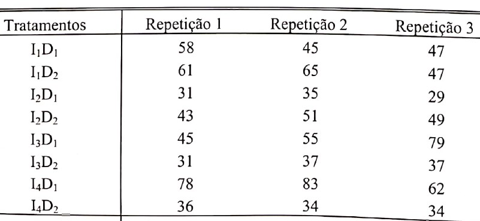
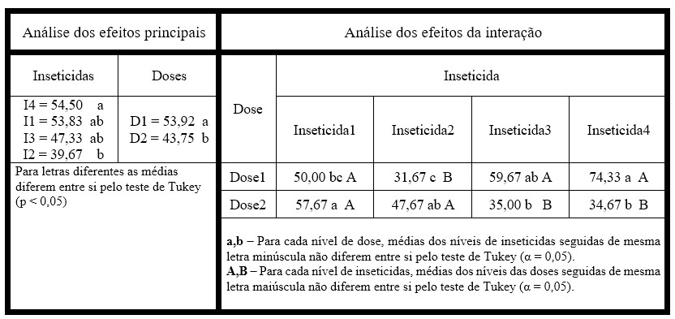
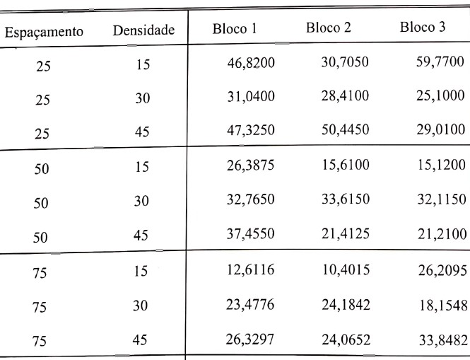
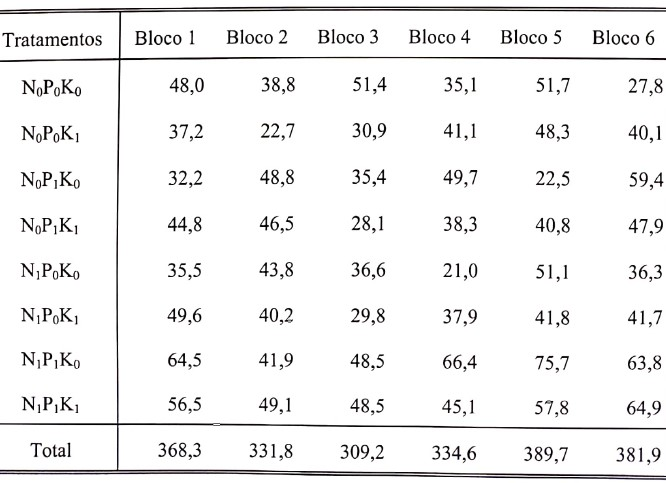
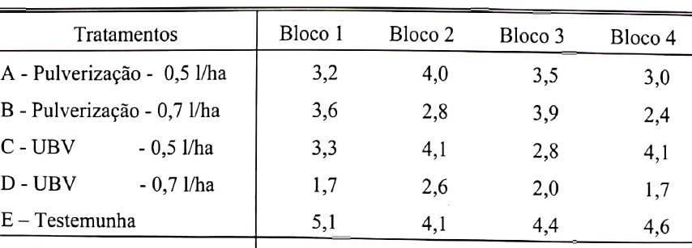

# Capítulo 6: Experimentos Fatoriais  
  
## Exemplo 6.4 (Pág. 178)  
Para a obtenção da Análise de Variância de um Experimento Fatorial com 2 fatores, suponha o seguinte ensaio em que foram estudados os efeitos de 4 inseticidas aplicadas em 2 doses diferenetes sobre s produção da cultura do milho, em kg/parcela:
 

As hipóteses a serem testadas são:  
**Para o efeito dos inseticida**
H~0~: Os inseticidas não diferem entre si quanto à produção da cultura do milho.

**Para o efeito das doses**
H~0~: As dosagens não diferem entre si em relação à produção da cultura do milho.  

**Para o efeito da interação**
H~0~: Os inseticidas e as dosagens não agem conjuntamente sobre a produção da cultura do milho.   


### Carregar os dados  

Carregar os dados a partir do link.
```{r}
dados6_4 = read.csv("https://raw.githubusercontent.com/genivaldomoreira/Analise_experimentos_agronomicos/main/Dados/exemplo6_4.csv", header = TRUE, sep = ";", dec = ".")
head(dados6_4, 8) # exibir as 8 primeiras linhas para conferir
```
  
### Determinação da Anova Fatorial
```{r, warning=FALSE, message=FALSE}
anova6_4 = aov(producao ~ inseticida + dose + inseticida:dose, 
               data = dados6_4)
summary(anova6_4)
```

**Conclusões**:   
**Para o efeito dos inseticida**
H~0~: Rejeita-se a hipóteses nula (p < 0,05).

**Para o efeito das doses**
H~0~: Rejeita-se a hipóteses nula (p < 0,05).  

**Para o efeito da interação**
H~0~: Rejeita-se a hipóteses nula (p < 0,05).  

### Análise dos pressupostos  
#### Visualização gráfica prévia  
  
```{r}
par(mfrow=c(2,2)) #visualizar 4 gráficos na mesma figura (2 linhas e 2 colunas)
plot(anova6_4) # plotar o gráfico
par(mfrow=c(1,1)) # retornar a visualização gráfica normal
```

#### Normalidade dos resíduos
```{r, warning=FALSE, message=FALSE}
residuos6_4 = anova6_4$residuals # cria um objeto com os resíduos do modelo

library(nortest)
shapiro.test(residuos6_4)
ad.test(residuos6_4)
ks.test(residuos6_4, "pnorm", mean(residuos6_4), sd(residuos6_4))
```

Verificou-se que os resíduos apresentaram normalidade (p-valor > 0,05)


#### Homogeneidade das variâncias
```{r, warning=FALSE, message=FALSE}
library(car)  
leveneTest(residuos6_4 ~ dados6_4$inseticida)
bartlett.test(residuos6_4 ~ dados6_4$inseticida)
leveneTest(residuos6_4 ~ dados6_4$dose)
bartlett.test(residuos6_4 ~ dados6_4$dose)
```

Verificou-se homoneidade em relação aos resíduos (p > 0,05)


Análise do desdobramento da interação e estudo dos efeitos de cada um dos fatores fixando-se os níveis do outro fator.


Utilizando o pacote **ExpDes**
```{r, message=FALSE, warning=FALSE}
library(ExpDes)
library(ExpDes.pt)
fat2.dic(dados6_4$inseticida,dados6_4$dose,dados6_4$producao,
            quali = c(TRUE, TRUE), mcomp = "tukey",
            fac.names = c("Inseticida", "Dose"),
            sigT = 0.05, sigF = 0.05)
```
OBS: Caso deseje cosultar o comando executado, use `help("fat2.dic")`  

Utilizando o pacote **easyanova**  
```{r, message=FALSE, warning=FALSE}
library(easyanova)
ea6_4 = ea2(dados6_4, design = 1, alpha = 0.05, cov = 4, list = FALSE, 
    p.adjust=1, plot=1)
ea6_4$`Adjusted means (factor 1)`
ea6_4$`Adjusted means (factor 2)`
ea6_4$`Adjusted means (factor 1 in levels of factor 2)`
ea6_4$`Adjusted means (factor 2 in levels of factor 1)`
ea6_4$`Analysis of variance`
ea6_4$`Residual analysis`
```

Para facilitar a interpretação dos resultados, preparamos uma tabela com a análise dos efeitos principais e dos efeitos da interação entre os fatores.  
Tabela 6.1: Analise dos efeitos dos tratamentos e da interação



## Exemplo 6.7 (Pág. 186)  
Considere um trabalho em que foram utilizados 3 espaçamentos entre linhas (25 cm, 50 cm e 75 cm) e 3 densidades de plantas por metro linear (15, 30 e 45 plantas por metro linear). O delineamento foi instalado em blocos casualizados com 3 repetições, e os dados obtidos para a produção de massa verda (t/ha), 139 dias após a semeadura, foram os seguintes:
 

As hipóteses a serem testadas são:  
**Para o efeito dos espaçamentos**
H~0~: Os espaçamentos não apresentam diferença em relação à produção de massa verde de *Crotalaria juncea*, ao nível de sigificância 5%.

**Para o efeito das densidades**
H~0~: As densidades não apresentam diferença em relação à produção de massa verde de *Crotalaria juncea*, ao nível de sigificância 5%.  

**Para o efeito da interação**
H~0~: Os espaçamentos e as densidades não agem conjuntamente sobre a produção de massa verde de *Crotalaria juncea*, ao nível de sigificância 5%.  

### Carregar os dados  

Carregar os dados a partir do link.
```{r}
dados6_7 = read.csv("https://raw.githubusercontent.com/genivaldomoreira/Analise_experimentos_agronomicos/main/Dados/exemplo6_7.csv", header = TRUE, sep = ";", dec = ".")
head(dados6_7, 8) # exibir as 8 primeiras linhas para conferir
```

Considerando que os níveis dos fatores são quantitativos, vamos torná-los em fatores, para fins de realização da Anova.

```{r}
espacamento=as.factor(dados6_7$espacamento)
densidade = as.factor(dados6_7$densidade)
bloco = as.factor(dados6_7$bloco)
massa_verde = dados6_7$massa_verde

dados6_7 = data.frame(espacamento, densidade, bloco, massa_verde)
str(dados6_7)
```


### Determinação da Anova Fatorial
```{r, warning=FALSE, message=FALSE}
anova6_7 = aov(massa_verde ~ espacamento + densidade + bloco + espacamento:densidade, data = dados6_7)
summary(anova6_7)
```

**Conclusões**:   
**Para o efeito dos espaçamentos**
H~0~: Rejeita-se a hipóteses nula (p < 0,05).

**Para o efeito das densidades**
H~0~: Não se rejeita a hipóteses nula (p > 0,05).  

**Para o efeito da interação**
H~0~: Rejeita-se a hipóteses nula (p < 0,05).  

### Análise dos pressupostos  
#### Visualização gráfica prévia  
  
```{r}
par(mfrow=c(2,2)) #visualizar 4 gráficos na mesma figura (2 linhas e 2 colunas)
plot(anova6_7) # plotar o gráfico
par(mfrow=c(1,1)) # retornar a visualização gráfica normal
```


#### Normalidade dos resíduos
```{r, warning=FALSE, message=FALSE}
residuos6_7 = anova6_7$residuals # cria um objeto com os resíduos do modelo

library(nortest)
shapiro.test(residuos6_7)
ad.test(residuos6_7)
ks.test(residuos6_7, "pnorm", mean(residuos6_7), sd(residuos6_7))
```


#### Homogeneidade das variâncias
```{r, warning=FALSE, message=FALSE}
library(car)  
leveneTest(residuos6_7 ~ dados6_7$espacamento)
bartlett.test(residuos6_7 ~ dados6_7$densidade)
leveneTest(residuos6_7 ~ dados6_7$espacamento)
bartlett.test(residuos6_7 ~ dados6_7$densidade)
```

Análise do desdobramento da interação e estudo dos efeitos de cada um dos fatores fixando-se os níveis do outro fator.


Utilizando o pacote **ExpDes**
```{r, message=FALSE, warning=FALSE}
library(ExpDes)
library(ExpDes.pt)
fat2.dbc(dados6_7$espacamento, dados6_7$densidade, 
         dados6_7$bloco, dados6_7$massa_verde, quali=c(TRUE,TRUE),
         mcomp="lsd", fac.names=c("Espaçamento","Densidade"), 
         sigT = 0.05, sigF = 0.05)
```
OBS: Caso deseje cosultar o comando executado, use `help("fat2.dbc")`  

Utilizando o pacote **easyanova**  
```{r, message=FALSE, warning=FALSE}
library(easyanova)
ea6_7 = ea2(dados6_7, design = 2, alpha = 0.05, cov = 1, 
    list = FALSE, p.adjust=1, plot=1)

ea6_7$`Analysis of variance`
ea6_7$`Adjusted means (factor 1)`
ea6_7$`Adjusted means (factor 2)`
ea6_7$`Adjusted means (factor 1 in levels of factor 2)`
ea6_7$`Adjusted means (factor 2 in levels of factor 1)`
```

OBS: Recomendamos uma comparação dos resultados aqui obtidos com os resultados apresentados no livro (páginas 192 e 195). Em seguida, aconselhamos a construção de uma tabela que apresente os resultados de forma resumida dos efeitos simples bem como da interação entre os fatores, conforme Tabela 6.1 apresentada no Exemplo anterior.   


# Capítulo 7: Experimentos Fatoriais com 3 fatores  
  
## Exemplo 7.2 (Pág. 214)  
Analisar os seguintes dados adapatados do trabalho "Efeitos da Adubação N, P e K no desenvolvimento inicial de progênies de *Eucaliptus grandis Hill Ex Maiden* em condições de casa de vegetação", realizado por Pires (1992). As alturas das plantas em cm, 150 dias após a semeadura foram:
 

As hipóteses a serem testadas são:  
**Para efeito de N** - H~0~: Os níveis de N possuem efeitos semelhantes sobre a altura das mudas de *Eucaliptus grandis*.  
**Para efeito de P** - H~0~: Os níveis de P possuem efeitos semelhantes sobre a altura das mudas de *Eucaliptus grandis*.  
**Para efeito de K** - H~0~: Os níveis de K possuem efeitos semelhantes sobre a altura das mudas de *Eucaliptus grandis*.  
**Para efeito da interação NxP** - H~0~: Os fatores N e P agem independentemente sobre a altura das mudas de *Eucaliptus grandis*.  
**Para efeito da interação NxK** - H~0~: Os fatores N e K agem independentemente sobre a altura das mudas de *Eucaliptus grandis*.  
**Para efeito da interação PxK** - H~0~: Os fatores P e K agem independentemente sobre a altura das mudas de *Eucaliptus grandis*.  
**Para efeito da interação NxPxK** - H~0~: Os fatores N, P e K agem independentemente sobre a altura das mudas de *Eucaliptus grandis*.  


OBS: Considerando que os experimentos com 33 fatores produzem extensa discussão sobre os resultados dos efeitos simples dos fatores, bem como da interação entre eles, apresentaremos apenas o script para a realização dos testes e recomendamos ao leitor uma análise crítica dos resultados, comparando os resultados do livro adotado como referência (páginas 214 a 223). 


### Carregar os dados  

Carregar os dados a partir do link.
```{r}
dados7_2 = read.csv("https://raw.githubusercontent.com/genivaldomoreira/Analise_experimentos_agronomicos/main/Dados/exemplo7_2.csv", header = TRUE, sep = ";", dec = ".")
head(dados7_2, 10) # exibir as 10 primeiras linhas para conferir
```

Análise por meio do pacote **ExpDes**
```{r, message=FALSE, warning=FALSE}
library(ExpDes)
library(ExpDes.pt)
fat3.dbc(dados7_2$nitrogenio, dados7_2$fosfoso, 
         dados7_2$potassio, dados7_2$bloco,
         dados7_2$altura, quali = c(TRUE, TRUE, TRUE),
         mcomp = "tukey", 
         fac.names = c("Nitrogênio", "Fósforo", "Potássio"),
         sigT = 0.05, sigF = 0.05)
```
OBS: Caso deseje cosultar o comando executado, use `help("fat3.dbc")`  

Análise por meio do pacote **easyanova**
```{r, message=FALSE, warning=FALSE}
library(easyanova)
ea7_2 = ea2(dados7_2, design = 8, alpha = 0.05, cov = 4, 
    list = FALSE, p.adjust=1, plot=1)
ea7_2
```


## Exemplo 8.2 (Pág. 228) - Experimentos fatoriais com tratamentos adicionais  
Suponha um ensaio em que foram estudados os efeitos de dois métodos de aplicação (Pulverização e UBV) e duas doses (0,5 e 0,7 l/ha) do inseticida Lorsbson sobre o controle do tripes na cultura do amendoim. os resultados obtidos para numero de tripes (tomando 10 ponteiros por parcela) transformados em $sqrt(x)$, foram:
 

As hipóteses a serem testadas são:  
**Para testemunha versus tratados** - H~0~: O inseticida Lorsban possui efeito semelhante ao tratamento testemunha no controle do tripes na cultura do amendoim.   
**Para efeito dos métodos** - H~0~: Os métodos de aplicaçao do inseticida possuem efeitos semelhtantes entre si em relação ao controle do tripes na cultura do amendoim.   
**Para efeito da doses** - H~0~: As doses de aplicaçao do inseticida possuem efeitos semelhtantes entre si em relação ao controle do tripes na cultura do amendoim.   
**Para efeito da interação entre métodos e doses** - H~0~: Os métodos de aplicação e as doses agem independentemente sobre o controle do tripes na cultura do ameindoim.  


OBS: Da mesma forma do exemplo anterior, apresentaremos apenas o script para a realização dos testes e recomendamos ao leitor uma análise crítica dos resultados, comparando os resultados do livro adotado como referência (páginas 228 a 232).   


### Carregar os dados  

Carregar os dados a partir do link.
```{r}
dados8_2 = read.csv("https://raw.githubusercontent.com/genivaldomoreira/Analise_experimentos_agronomicos/main/Dados/exemplo8_2.csv", header = TRUE, sep = ";", dec = ".")
head(dados8_2, 10) # exibir as 10 primeiras linhas para conferir
```

Análise por meio do pacote **ExpDes**
```{r, message=FALSE, warning=FALSE}
library(ExpDes)
library(ExpDes.pt)
metodo = dados8_2$metodo
metodo
dose = dados8_2$dose
dose
bloco = dados8_2$bloco
bloco
tripes = dados8_2$tripes
tripes
testemunha8_2 = c(5.1,4.1,4.4,4.6)
testemunha8_2

fat2.ad.dbc(metodo, dose, bloco, tripes, testemunha8_2, 
            quali=c(TRUE, FALSE), mcomp = "tukey", 
            fac.names = c("metodo", "dose"), 
            sigT = 0.05, sigF = 0.05)
```
OBS: Caso deseje cosultar o comando executado, use `help("fat2.ad.dbc")`  
