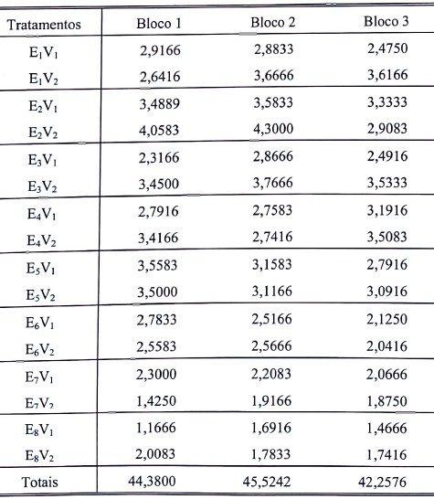
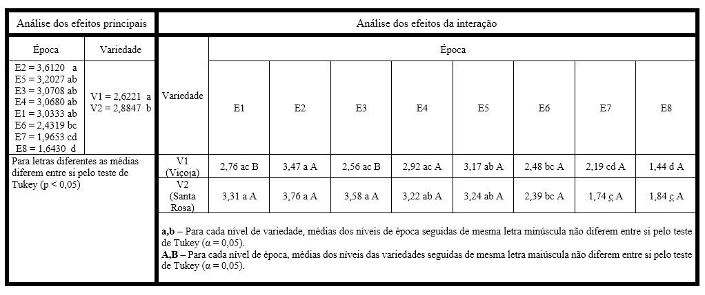
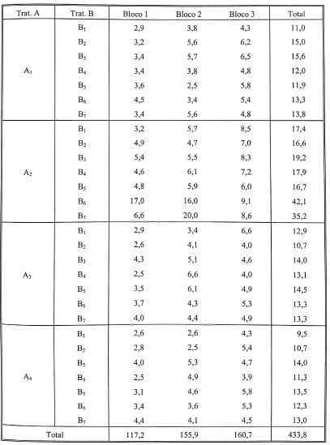

# Capítulo 9: Experimentos em parcelas subdivididas  
  
## Exemplo 9.2 (Pág. 250)  
Para a obtenção da análise de vairiância de um experimento em parcelas subdivididas, vamos utilizar os dados obtidos do trabalho intitulado "Efeito de épocas de plantio sobre várias características agronômicas na sultura da soja (*Glycine max.* (L.) Merril), variedades Santa Rosa e Viçoja, em Jaboticabal, SP", realizado por YUYAMA (1976). Foram utilizadas 8 eócas de plantio (20/10/74, 30/10/74, 10/11/74, 20/11/74, 30/11/74, 10/12/74, 20/12/74 e 30/12/74) e 2 variedades de soja (V~1~ = Viçoja e V~2~ = Santa Rosa). O ensaio foi montado de acordo com delineamento em parcelas subdivididas, com as épocas de plantio nas parcelas, e as variedades na subparcelas. Os resultados obtidos para a produção de grãos (t/ha), foram os seguintes:  
 

As hipóteses a serem testadas são:  
**Para o efeito das épocas**
H~0~: As épocas de plantio não diferem entre si em relação à produção da cultura de soja.

**Para o efeito das variedades**
H~0~: As variedades não diferem entre si em relação à produção da cultura de soja.  

**Para o efeito da interação**
H~0~: As épocas e as variedades não agem conjuntamente sobre a produção da cultura da soja.   


### Carregar os dados  

Para baixar o arquivo:   (`https://www.dropbox.com/s/epsg5181ad6xxs6/exemplo9_2.csv?dl=0`)  

Carregar os dados a partir do link.
```{r}
dados9_2 = read.csv("https://www.dropbox.com/s/epsg5181ad6xxs6/exemplo9_2.csv?dl=1", header = TRUE, sep = ";", dec = ".")
head(dados9_2, 8) # exibir as 8 primeiras linhas para conferir
```
  
### Análise por meio do pacote **ExpDes** e **ExpDes.pt**
  
OBS: Caso deseje cosultar o comando a ser executado, depois de carregar o pacote, use `help("psub2.dbc")`

```{r, warning=FALSE, message=FALSE}
library(ExpDes)
library(ExpDes.pt)
psub2.dbc(dados9_2$epoca,dados9_2$variedade,
  dados9_2$bloco, dados9_2$producao, quali = c(TRUE, TRUE),
  mcomp = "tukey", fac.names = c("Época", "Variedade"),
  sigT = 0.05, sigF = 0.05)
```


  
### Análise por meio do pacote **Easyanova**

OBS: Antes de iniciar a análise pelo pacote **Easyanova**, vamos fazer uma pequena alteração nas colunas do *data.frame* `dados9_2`. Execute o comando `head(dados9_2, 4)`e veja a sequência das colunas.

```{r, message=FALSE, warning=FALSE, echo=FALSE}
head(dados9_2)

```

Agora vamos inverter as posição das colunas que contem os dados da variedade e dos blocos. Vamos chamar o novo objeto de `dados9_2_easy`:

```{r, message=FALSE, warning=FALSE}
dados9_2_easy = data.frame(dados9_2$epoca, dados9_2$bloco,dados9_2$variedade, dados9_2$producao)
colnames(dados9_2_easy) = c("epoca", "bloco", "variedade", "producao") # muda o nome das colunas
head(dados9_2_easy)
```

Agora é só executar o comando do pacote **Easyanova**. Caso deseje ajuda sobre o comando, carregue o pacote e depois execute o comando `help("ea2")`.

```{r, warning=FALSE, message=FALSE}
library(easyanova)
ea9_2 = ea2(dados9_2_easy, design = 5, alpha = 0.05, cov = 4, 
    list = FALSE, p.adjust=1, plot=1)
ea9_2
```

A seguir apresentamos apresentamos uma tabela com a análise dos efeitos principais e dos efeitos da interação entre os fatores.  
Aproveite para comparar os resultados encontrados com os que são apresentados e discutidos no livro.  


# Capítulo 11: Experimentos em faixas ("Split Block")  
  
## Exemplo 11.2 (Pág. 297)  
Para exemplificar a obtenção da análise de variância de um experimento em faixas, vamos utilizar os dados de teor de potássio no solo (K), apresentados por Marcelo (2007). O experimento foi instalado em 3 blocos, com dois fatores dispostos em faixas. Os fatores estudados foram:  
A - Culturas de verão  
B - Culturas de inverno  

Foram estudados os seguintes níveis do fator A:  
  
A~1~ = Rotaçao SM (Soja/milho)  
A~2~ = Rotação AFA (Arroz/feijão/algodão)  
A~3~ = Milho  
A~4~ = Soja  
  
Os níveis do fator B foram os seguintes:
  
B~1~ = Milho  
B~2~ = Girassol  
B~3~ = Nabo forrageiro  
B~4~ = Milheto  
B~5~ = Guandu  
B~6~ = Sorgo  
B~7~ = Crotalária  
  
Os dados obtidos do teor de potássio no solo (K) são apresentados no quadro a seguir:  
     

  

### Carregar os dados  

Para baixar o arquivo:   (`https://www.dropbox.com/s/89jyx2rdv6hy3jn/exemplo11_2.csv?dl=0`)  

Carregar os dados a partir do link.
```{r}
dados11_2 = read.csv("https://www.dropbox.com/s/89jyx2rdv6hy3jn/exemplo11_2.csv?dl=1", header = TRUE, sep = ";", dec = ".")
head(dados11_2) # exibir as primeiras linhas para conferir
```

### Análise por meio do pacote **ExpDes** e **ExpDes.pt**
  
OBS: Caso deseje cosultar o comando a ser executado, depois de carregar o pacote, use `help("faixas")`

```{r, message=FALSE, warning=FALSE}
library(ExpDes.pt)
library(ExpDes)
faixas(dados11_2$fatorA, dados11_2$fatorB, 
       dados11_2$bloco, dados11_2$teor,
       quali = c(TRUE, TRUE), mcomp = "tukey", 
       fac.names = c("Fator A", "Fator B"), 
       sigT = 0.05, sigF = 0.05)
```
  
  

#### Análise do efeito isolado do fator A  
```{r, message=FALSE, warning=FALSE}
fatorA11_2= dbc(dados11_2$fatorA, dados11_2$bloco, dados11_2$teor, 
    quali = TRUE, mcomp = "tukey", nl = FALSE,
    hvar = "oneillmathews", sigT = 0.05, sigF = 0.05)
```


#### Análise do efeito isolado do fator B  
```{r, message=FALSE, warning=FALSE}
dbc(dados11_2$fatorB, dados11_2$bloco, dados11_2$teor, 
    quali = TRUE, mcomp = "tukey", nl = FALSE,
    hvar = "oneillmathews", sigT = 0.05, sigF = 0.05)
```

  
#### **OBS:** Compare os resultados com os apresentados nas páginas 303 e 311 do livro-texto.